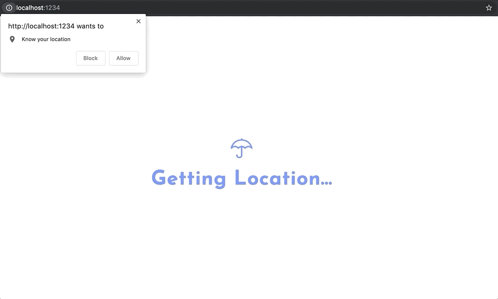

# 💦 Umbrella Weather App ☔

Umbrella is a simple weather app that is focused on giving you highly accurate current conditions so you can plan your rain-wear strategy. It utilizes the [Dark Sky API](https://darksky.net/dev), Google Maps API and the browser Geolocation API to show a quick summary of the current weather -- if it's raining, it will let you know by the minute how long it is going to rain for -- as well as an average percentage of precipatation for the hour.




## How do I set it up?

You'll need to grab unique API keys from [Dark Sky](https://darksky.net/dev) and [Google Maps](https://developers.google.com/maps/documentation/javascript/get-api-key).

After that, grap a copy of this repository:

```
git clone https://github.com/CarsonBain/umbrella.git
```

In `./js/settings.js` add in your Google and Dark Sky API keys:

```
export const settings = {
  GAPIkey: "YOUR_GOOGLE_MAPS_API_KEY",
  DSAPIkey: "YOUR_DARKSKY_API_KEY"
};
```

Now you're good to build the application with [Parcel](https://github.com/parcel-bundler/parcel). Run the following in your command line:

```
npm install
```

To run in development mode and view on `http://localhost:1234`:

```
npm run dev
```

To run in production mode:

```
npm run build
```

⚡ **Enjoy!** ⚡

### Troubleshooting Tips

If you're seeing console errors related to the Google Maps API, make sure you have the proper APIs enabled. See this SO post for more information: https://stackoverflow.com/a/50397830/10792880
