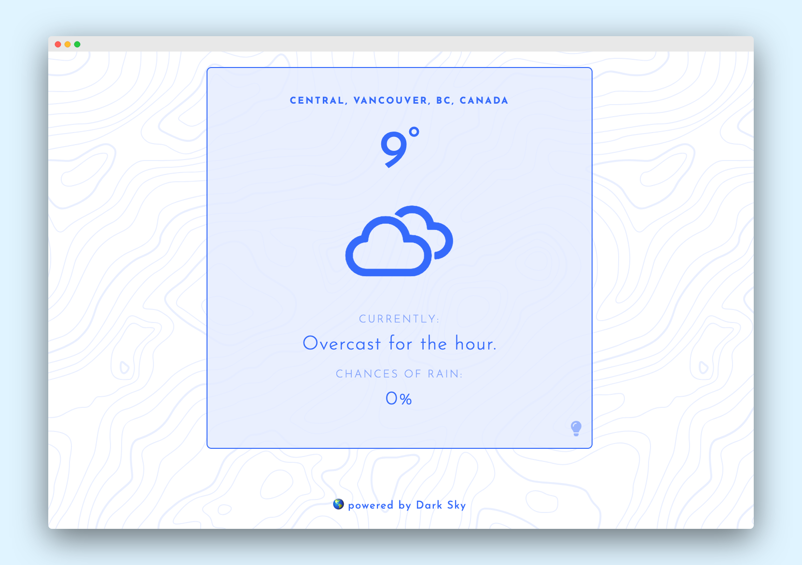
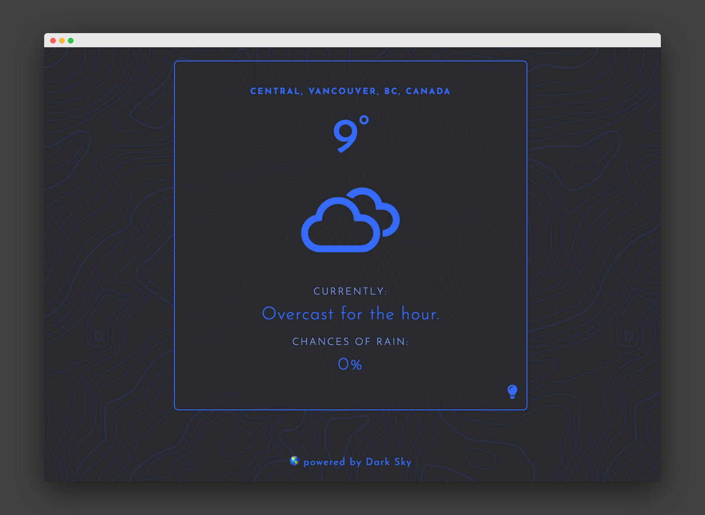

# 💦 Umbrella Weather App ☔
https://umbrella-weather.netlify.com/

Umbrella is a simple weather app that is focused on giving you highly accurate current conditions so you can plan your rain-wear strategy. It utilizes the [Dark Sky API](https://darksky.net/dev), Google Maps API and the browser Geolocation API to show a quick summary of the current weather -- if it's raining, it will let you know by the minute how long it is going to rain for -- as well as an average percentage of precipatation for the hour.

⚡ **Enjoy!** ⚡
